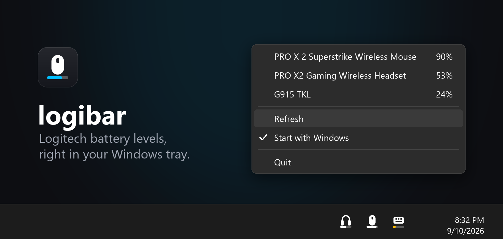

# logibar 🔋

Your Logitech mouse, headset and keyboard battery, right in the Windows tray.



- 🖱️ One tray icon per device, with a battery bar under it
- 🟡 Bar turns yellow at 30%, 🔴 red at 15% (plus a "time to charge" alert)
- 🌗 Matches your light or dark taskbar
- 🪶 Tiny. No account, no internet, it just reads what G HUB already knows

## 🚀 Install

1. Have **[Logitech G HUB](https://www.logitechg.com/innovation/g-hub.html)** installed
2. Download **[logibar.exe](https://github.com/canmenzo/logibar/releases/latest/download/logibar.exe)**
3. Double-click it. Done ✅

💡 **"Windows protected your PC"?** Click **More info → Run anyway**.<br>
💡 **Don't see the icons?** Click **^** next to the clock and drag them onto the taskbar.<br>
💡 **Start on boot:** right-click an icon → **Start with Windows**.

## 🗑️ Uninstall

Right-click an icon → untick **Start with Windows** → **Quit**. Then delete `logibar.exe`.

## 🛠️ Build from source

Needs [Python 3.11+](https://www.python.org/downloads/).

```powershell
git clone https://github.com/canmenzo/logibar
cd logibar
powershell -ExecutionPolicy Bypass -File install.ps1
```

<sub>Not affiliated with Logitech.</sub>
